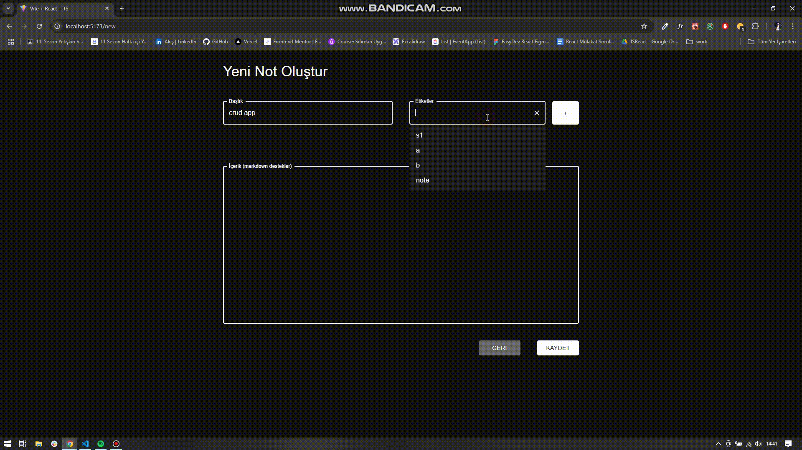

# 📝 Note App with TypeScript

This project is a simple and efficient note-taking web application built with modern technologies such as React, TypeScript, Redux Toolkit, and Material-UI (MUI). Users can create, edit, categorize, and view their notes with a clean and responsive interface.

🔗 Live Demo: Note App with TS  
🔗 GitHub Repository: GitHub Repo

# 🚀 Features

✅ Create, Edit, and Delete Notes:

- Easily add new notes with title and content.
- Edit or remove existing notes seamlessly.

✅ Markdown Support:

- Notes support Markdown formatting using react-markdown for richer content.

✅ Tagging and Filtering:

- Categorize notes with tags.
- Filter notes based on selected tags using react-select.

✅ Persistent Storage:

- Notes are stored locally in the browser using redux-persist, ensuring data remains after refreshing.

✅ Responsive Design:

- Built with Material-UI (MUI) for a modern, consistent, and mobile-friendly user interface.

# 🛠️ Technologies Used

- React 19 & TypeScript
- Redux Toolkit & Redux Persist
- React Router DOM 7
- React Markdown
- React Select
- Material-UI (MUI) 6
- UUID (for unique note IDs)
- Emotion (for styling with MUI)

